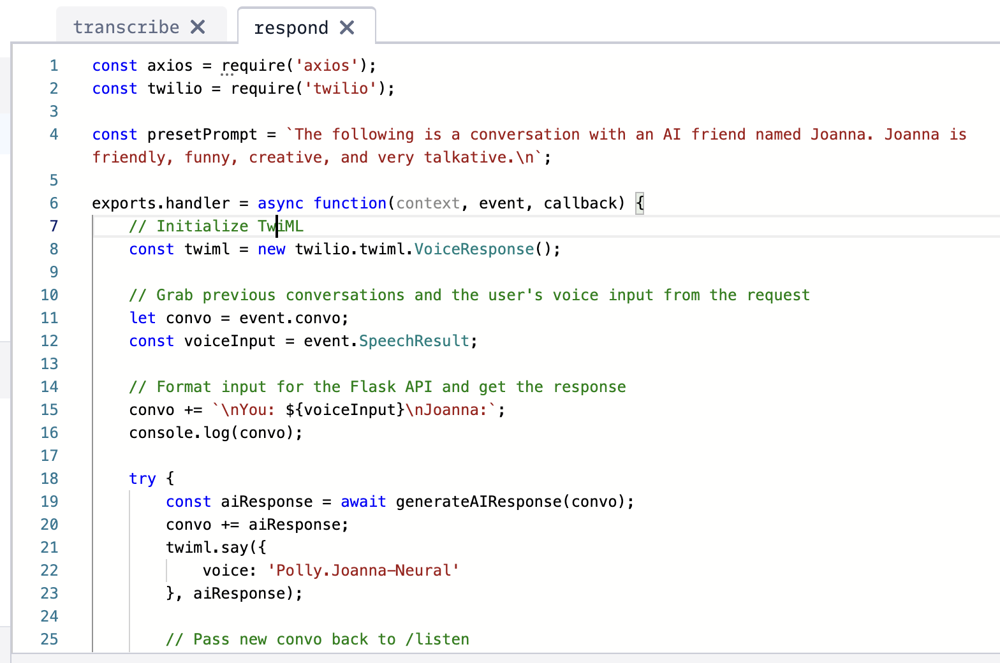
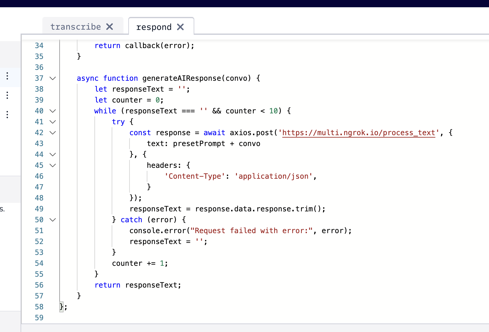
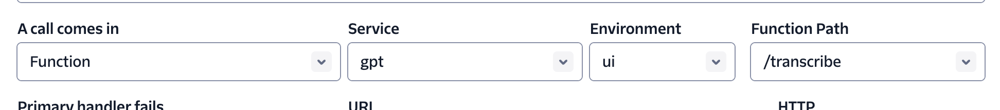

# Flask App for Twilio

This is a very basic flask ap


## Installation

1. Create a `.env` file and place your openai key here like
```
OPENAI_API_KEY=sk-***
```

2. run the flask app with `python app.py`
3. Install [ngrok](https://ngrok.com/download) and run `ngrok http 5001`

4. Setup a Twilio account and set up Functions:

Transcribe to run on pick up

<div style="text-align: center;">
        
    </a>
</div>

Respond to run every time the human speaks

<div style="text-align: center;">
        
    </a>
</div>
<div style="text-align: center;">
        
    </a>
</div>

5. Obtain a Twilio phone number and set the voice configuration

<div style="text-align: center;">
        
    </a>
</div>

Call and talk!